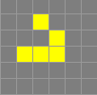
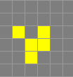
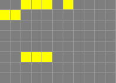

# Conway's Game of Life

## 题目描述

Xiaoh 想在工程题里出一些好玩的内容，于是就有了这道题。~~工程题：指对助教而言工程量很大~~


康威生命游戏是由英国数学家 John Horton Conway 在1970年基于细胞自动机修改而成的一个小游戏。它的规则如下：

- 整个游戏由一个无限大的网格组成。在这里我们为了简化问题，假设网格的大小为$n\times m$；
- 网格内的每一个格子代表一个细胞，细胞有两种状态：存活和死亡。 如果这一格的细胞存活，那么它将被染成黑色；否则，他将保持白色；
- 在游戏的每一“步”中，细胞的状态将基于其周围8个格子的状态改变自身的状态：
  - 如果一个活细胞周围的活细胞$<2$，那么他会在下一步死亡，以此模拟人口不足（underpopulation）；
  - 如果一个活细胞周围的活细胞$=2$或$=3$，那么它将继续在下一步存活；
  - 如果一个活细胞周围的活细胞$>3$，那么它将在下一步死亡，以此模拟人口过多（overpopulation）；
  - 如果一个死细胞周围的活细胞$=3$，那么它将在下一步变为活细胞，以此模拟 ~~打赢复活赛~~ 细胞繁殖。


例如，



对于如上的状态，其下一步的状态为：



如果你希望了解更多关于康威生命游戏的规则与内容，可以看[这里](https://en.wikipedia.org/wiki/Conway%27s_Game_of_Life)。如果想自己上手试试，可以看[这里](https://playgameoflife.com/)（建议模拟一下上述demo以确认你对游戏规则的理解无误）


你可以注意到，一旦初始状态确定，这个游戏未来的每一步都是固定的（除非你在中途手动修改了某些细胞的状态）。


对康威生命游戏“模式”（pattern, 也就是这个游戏的初始状态）的设计一直是一大显学。在我们为你提供的testcases，你可以看到我们挑选出来的一部分很有意思的 patterns， 甚至包括一个可用的[图灵机](https://en.wikipedia.org/wiki/Turing_machine)。如果想了解更多有趣的 patterns， 可以前往[LifeWiki](https://conwaylife.com/wiki/)。


Xiaoh为这个游戏编写了一份完整的可视化工具以及运行脚本（使用方法将在下发文件中），可以将你程序模拟的游戏过程以可视化的形式展现。我们非常鼓励各位尝试一下这个工具。~~（写题之余还能玩玩小游戏岂不美哉）~~


你需要补全一些函数，用以模拟康威生命游戏的过程。你需要实现的函数接口及功能如下：

`void Initialize()`： 从标准输入读入游戏地图并初始化你的程序。这个函数**仅会在程序开头被调用一次**。输入格式请参见`输入格式`部分

`void Tick()`： 模拟游戏的“一步”操作，并更新地图和状态变量。

`void PrintGame()`:  按照特定格式输出当前的游戏地图，输出格式请参见`输出格式`部分。

`int GetLiveCell()`：返回当前游戏地图中存活的细胞数量。

关于这些函数内容的更多信息请查看下发文件中的`game_of_life.hpp`。


关于可视化工具/脚本的使用方法，以及测试点信息，请查看下发文件中的`tutorial.md`或`tutorial.pdf`。

## 输入格式

可以注意到，当地图很大时，逐个输入每个格子的状态是一个低效的方式。因此我们将采用类似于[官方`.rle`文件的格式](https://conwaylife.com/wiki/Run_Length_Encoded)的输入整张地图。


对于一个$row$行$col$列的地图，我们用如下方式描述它的 pattern:

- `b`表示**死细胞**， `o`表示**活细胞**
- `数字 + b/o`表示**多个连续的某种细胞**，例如：`10bob`表示这一行前$10$个细胞是死细胞，第$11$个细胞是活细胞，第$12$个细胞是死细胞
- `1b`可以用单独的`b`代替，`1o`可以用单独的`o`代替
- `$`表示**开始描述新的一行**。如果开始新的一行时，`$`前面的细胞数小于列数，那么没有被描述的所有细胞都**默认为死细胞**。
  - 例如，对$col=10$，`3bo$o$2o`表示的意思是：第一行的第$4$个细胞是活细胞，第二行的第$1$个细胞是活细胞，第三行前$2$个细胞是活细胞，其余全部是死细胞。
- 可以使用`数字+$`表示多个连续的换行符。例如：`2$`与`$$`是等价的，它的意思是：结束前一行后，下一行是一个空行（因为我们并没有指定任何活细胞）。
- 如果 pattern 描述的行数<总行数，那么没有被描述的所有行全部默认为空行
- `!`表示结束 pattern 的描述。 `!`后面的内容可以忽略。


需要注意的是， pattern 输入时可能会有多行，你需要一直读取直到读到包含`!`的行为止。对于`数字+b/o/!`格式的内容，我们保证他们将出现在同一行内，且同一行内的所有字符间**不会**有空格分隔。


例如，

```plaintext
2b3obo$2b
3$2b3o
```

上面的 pattern 是下图（$row = 8$, $col = 11$）中状态的一个合法 pattern:




当`Initialize()`函数被调用时，你需要从标准输入中读取如下信息：

第一行两个整数，分别表示网格的列数和行数。

接下来多行将描述游戏的 pattern, 你需要一直读取直到读取到包含`!`的行为止。


## 输出格式

当调用`PrintGame()`函数时，你需要输出当前的游戏地图，其格式如下：


第一行两个整数，分别表示地图的列数和行数。


第二行一行字符串，表示当前地图的 pattern，格式与输入格式一致，但为了方便**禁止换行**，将所有信息连成一行即可。


我们将使用 Special Judge 对你输出的 pattern 进行比对，只要是**满足语法规则**且**描述正确**的格式我们都将认为是正确的。但为了确保你真正理解了 pattern 的压缩规则（且避免暴力地输出/Output Limit Exceeded），我们会使用你的 pattern 与助教std生成的 pattern长度进行对比，对于长度过长的 pattern 我们将扣取一定的分数。具体是公式为：pattern 正确提供$50\%$的分数，记你的 pattern 长度为 $src$，助教的 pattern 长度为 $std$，那么你这部分的成绩为：

- 若$\frac{src}{std}<1$，你将获得$50\%$的分数，并且你会在`special judge message`中获得助教的嘉奖。

- 若$\frac{src}{std}\le2$，那么你将获得$50\%$的分数。

- 若$2<\frac{src}{std}\le 6$，那么你将获得$50\% \times (6 - \frac{src}{std})\times \frac{1}{4}$。

- 若$\frac{src}{std}>6$，那么你将$0\%$的分数。


## 样例输入

见下发文件


## 样例输出

见下发文件


## 数据范围

对于Basic Test部分的测试点，保证$row, col\leq 500$且$row\times col\le 50000$，调用`Tick()`的次数$<100$，调用`Print()`次数$<200$，调用`GetLiveCell()`次数$<1\times 10^6$。

对于Pressure Test部分测试点，保证$row, col\le 13000$。设调用`Tick()`次数为$n$，最大存活的细胞数为$m$，则$n\times m\le 2\times 10^6$。
